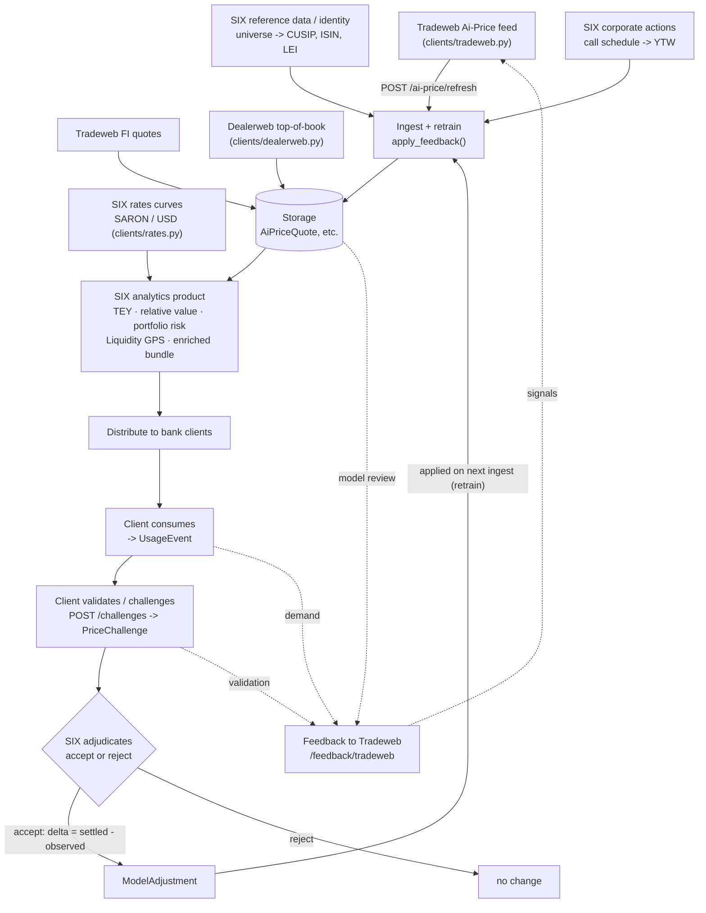

# SIX × Tradeweb service — calculation methodology

This document specifies, for every number the application produces, **where the
input comes from** and **how the calculation is made**, step by step. It is the
companion to the codebase: each formula below corresponds to a function in
`app/`.

---

## 0. Data provenance — read this first

There are two very different kinds of "source" in this system, and conflating
them is the main thing to avoid.

**Real-world context (researched, accurate).** The product relationships the
app models are real: SIX has distributed *Tradeweb Municipal Ai-Price* since
2022; Ai-Price evaluates ~1M US municipal bonds from MSRB trade data plus
Tradeweb platform data and is built to be reproducible/explainable; only a small
fraction of munis trade on a given day. *Dealerweb* is Tradeweb's inter-dealer
arm (largest TBA-MBS broker). *SARON* is the CHF overnight benchmark that SIX
administers, which replaced CHF LIBOR. These facts shape the design.

**In-app data (synthetic).** Every price, yield, curve level, spread, and
historical series the running app uses is **generated by deterministic mock
feeds**, not sourced from a live market. No MSRB, TRACE, Tradeweb, Dealerweb or
SIX production feed is connected. The clients are written with an injectable
HTTP transport so they *could* point at a real API, but as shipped they return
synthetic records.

**What this means for the calculations.** The *formulas* are the deliverable —
they are explainable and reproducible, in the spirit of how an evaluated-pricing
model must be defensible. The *inputs* are illustrative. So a number like a
tax-equivalent yield is computed by a correct formula on a synthetic price.
Nothing here is investment advice or a real valuation.

### Conventions

- **bp** = basis points = 0.01%. Percentages are in percent (e.g. `3.18` = 3.18%).
- **Determinism.** Mock feeds seed a RNG from a SHA-256 hash of identifying keys
  (e.g. `cusip | date | eod`), so the same inputs reproduce the same outputs.
  `U(a,b)` denotes a uniform draw, `Normal(μ,σ)` a normal draw, from that seeded
  RNG.
- **Rounding** is applied at the field level (typically 3–4 dp) and is omitted
  below for readability.
- **today / as_of** is the snapshot timestamp (UTC).

---

## 1. Source feeds and what each provides

*For the whole pipeline at a glance — beginning to end, with a graph — see
Section 14.*

| Feed | Module | Real-world analog | Status |
|---|---|---|---|
| Ai-Price municipal | `clients/tradeweb.py` | Tradeweb Municipal Ai-Price | synthetic |
| Fixed-income quotes | `clients/tradeweb.py` | Tradeweb evaluated FI prices | synthetic |
| Dealerweb top-of-book | `clients/dealerweb.py` | Dealerweb UST / TBA-MBS | synthetic, prospective |
| SIX rates curves | `clients/rates.py` | SARON / Swiss Reference Rates; USD curve | synthetic |
| Spread history | `clients/history.py` | a stored time series of spreads | synthetic |
| Reference / identity | `analytics/enrichment.py` + the universe table | SIX reference & corporate-actions data | synthetic |

The municipal universe is a fixed table of 12 bonds, each row carrying: CUSIP,
description, state, coupon, maturity, sector (`GO`/`REVENUE`), rating, callable
flag, call date, and size outstanding (USD mm). These are the "reference"
attributes; everything priced is derived from them.

---

## 2. Ai-Price evaluated record (`_build_record`)

This is the core synthetic feed: given a bond's reference row, it produces a
full evaluated record. The construction is deliberately *internally consistent*
(price, yield, duration and spread all tie out) so the downstream analytics are
meaningful.

**Step 1 — time to maturity.**
```
years = max((maturity − today) / 365.25, 0.25)
```

**Step 2 — AAA-muni benchmark yield** (a toy upward-sloping curve, percent):
```
bench = 2.55 + 0.045 × min(years, 30)
```

**Step 3 — effective duration** (a monotone approximation; longer maturity and
lower coupon → more duration), floored at 0.5:
```
duration = max( min(years × 0.82, 13.0) × (1 − 0.02 × (coupon − 4)), 0.5 )
```

**Step 4 — structural spread to the benchmark (bp).** Credit + sector + a
curve/duration term:
```
spread = RATING_BASE[rating] + (8 if REVENUE else 0) + 2.0 × duration
```
where `RATING_BASE` (bp) = AAA 5, AA+ 12, AA 20, AA- 28, A+ 40, A 55, A- 70,
BBB+ 110, BBB 150.

**Step 5 — liquidity-driven richness/cheapness (bp).** This is the key modelling
choice: small issues trade *cheap* (wider), benchmark-size issues trade *rich*
(tighter). It is the inefficiency the relative-value screen later surfaces:
```
liq_adj = 25 × max(0, (400 − size)/400) − 15 × max(0, (size − 500)/250)
spread += liq_adj + U(−4, 4)          # + U(−3, 3) extra if intraday
```

**Step 6 — yield and price.** Yield is benchmark plus spread; price is a
first-order (duration) approximation around par:
```
ai_yield = bench + spread / 100
ai_price = 100 − (ai_yield − coupon) × duration
```

**Step 7 — bid/ask.** A half-spread proportional to spread × duration, plus a
floor:
```
half = (spread/100) × duration × 0.06 + U(0.02, 0.12)
eval_bid = ai_price − half ;  eval_ask = ai_price + half
```

**Step 8 — convexity and DV01.**
```
convexity = duration² / 95
dv01 = duration × ai_price × 0.0001      # price points per 1bp per 100 face
```

**Step 9 — call-adjusted yields.** For a callable bond with a future call date:
```
ytc = ai_yield − U(0.05, 0.35) ;  ytw = min(ai_yield, ytc)
otherwise ytc = none, ytw = ai_yield
```

**Step 10 — liquidity score, trade count, confidence.** Higher-rated, larger,
more-traded issues score higher:
```
base_liq = 40 + (size/750) × 35 + (15 if rating starts "AAA" else 0)
trades_30d = max(0, round(Normal(base_liq/8, 3)))
liquidity_score = min(99, base_liq + trades_30d × 1.5 + U(−5, 5))
confidence = min(0.99, 0.70 + liquidity_score/400 + (0.05 if not callable else 0))
```

**Step 11 — spread to UST.** Pre-tax muni yields sit *below* Treasuries because
of the tax exemption, so this spread is negative:
```
ust_ratio = U(0.72, 0.88)
ust_yield = ai_yield / ust_ratio
ust_spread_bp = (ai_yield − ust_yield) × 100        # negative
```

---

## 3. Municipal analytics (`analytics/muni.py`)

### 3.1 Tax-equivalent yield (TEY)

The yield a *taxable* bond would need to match a tax-exempt muni, given a
marginal tax rate `t` (default 0.37):
```
TEY = ai_yield / (1 − t)
```
Step explanation: a muni paying `y` tax-free is worth the same after-tax as a
taxable bond paying `y/(1−t)` before tax. `t` is a single combined rate;
in-state double-exemption is left to the caller (a documented simplification).

### 3.2 Relative value (rich/cheap)

The screen compares each bond's *actual* spread to an *expected* spread it would
have for its risk, and flags the residual.

**Step 1 — expected spread (bp).** Note this model knows about rating, sector and
duration but **not** liquidity — that omission is deliberate:
```
expected = RATING_BASE[rating] + (8 if REVENUE else 0) + 2.0 × duration
```

**Step 2 — residual.** Actual minus expected:
```
residual = benchmark_spread_bp − expected
```
Because the feed put the liquidity adjustment (Step 5 above) *into* the actual
spread but the expected model leaves it out, the residual ≈ `liq_adj + noise`.
That is what makes small illiquid issues surface as **cheap** and large
benchmark issues as **rich**.

**Step 3 — percentile and signal.** Rank the residual across the universe; flag
on a ±10bp threshold:
```
percentile = 100 × #{ residuals ≤ residual } / n
signal = cheap  if residual ≥ +10
         rich   if residual ≤ −10
         fair   otherwise
```
Rows are returned sorted by residual, descending (cheapest first).

### 3.3 Market summary

Simple aggregates over the latest snapshot: `count`; mean `ai_yield`; the TEY of
the mean yield; mean `benchmark_spread_bp`; mean `effective_duration`; mean
`confidence`; the count and percent of *illiquid* bonds (`trades_30d == 0`); and
record counts bucketed by state, sector and rating.

---

## 4. Portfolio valuation & risk (`analytics/portfolio.py`)

Inputs: a list of holdings `(cusip, par)` and the latest Ai-Price record per
CUSIP.

**Step 1 — mark each position and total.** Market value uses the evaluated mid
on par/100:
```
MV_i = par_i × ai_price_i / 100
total_MV = Σ MV_i
```

**Step 2 — market-value weights.**
```
w_i = MV_i / total_MV
```

**Step 3 — weighted risk/return.** Each is the MV-weighted average:
```
weighted_duration  = Σ w_i × duration_i
weighted_yield     = Σ w_i × ai_yield_i
weighted_TEY       = Σ w_i × TEY(ai_yield_i, t)
weighted_confidence= Σ w_i × confidence_i
```

**Step 4 — portfolio DV01.** Per-position DV01 scaled to face (`dv01` is per 100
face), then summed:
```
portfolio_DV01 = Σ dv01_i × (par_i / 100)
```

**Step 5 — allocations.** Sector and rating weights are the sum of `w_i` within
each bucket (each set sums to 1). CUSIPs with no current mark are reported as
`missing_cusips` and excluded from the weights.

---

## 5. Dealerweb top-of-book (`clients/dealerweb.py`)

Synthetic inter-dealer two-sided markets. UST is quoted tighter than MBS, which
is the real-world relationship.

**US Treasuries:**
```
mid = 100 − (base_yield − 4.0) × 2 + U(−0.20, 0.20)
half = U(0.004, 0.020)                       # tight inter-dealer market
bid = mid − half ;  ask = mid + half
spread_bp = (ask − bid) / mid × 10000
liquidity = min(99, 92 − tenor_adj + U(−3, 3))   # tenor_adj: 30Y=6, 5Y=2, else 0
```

**TBA-MBS** (wider markets; liquidity rises with coupon):
```
mid = 98 + (coupon − 5.0) × 1.6 + U(−0.25, 0.25)
half = U(0.015, 0.060)
spread_bp = (ask − bid) / mid × 10000
liquidity = min(98, 78 + (coupon − 5.0) × 4 + U(−5, 5))
```
Bid/ask sizes (mm) are uniform draws (UST 25–300, MBS 50–500).

**Liquidity analytics** (`/dealerweb/analytics/liquidity`) aggregate per product:
mean `spread_bp`, the tightest instrument, mean liquidity, and total top-of-book
size (Σ bid_size + ask_size).

---

## 6. Liquidity intelligence — signals (`analytics/liquidity.py`)

These run on a time series of a *liquidity* measure (a bid/ask or other spread,
in bp). The history is synthetic (Section 7); the signal math is standard.

### 6.1 Dislocation (z-score)

How far today's level sits from its own recent history, in standard deviations.
Over a trailing window `W = 63` (≈ one quarter):
```
z = (s[last] − mean(window)) / stdev(window)        # 0 if window < 2 or stdev = 0
```

### 6.2 Drift

The *momentum* of dislocation — z now minus z `L = 20` points ago (≈ one month).
This is the early-warning term:
```
drift = z(last) − z(last − 20)
```

### 6.3 Stress score (0–100)

A linear composite where 50 is neutral; a wider-than-normal spread (positive z)
and accelerating widening (positive drift) both raise stress:
```
stress = clamp( round(50 + 18 × z + 10 × drift), 0, 100 )
```

### 6.4 Classifications

```
regime  : z ≥ +0.8 → stressed ; z ≤ −0.8 → easing ; else normal
stretch : max(0,z) ≥ 1.5 → High ; ≥ 0.5 → Medium ; else Low
drift   : drift ≥ +0.5 → Rising ; ≤ −0.5 → Falling ; else Stable
risk    : stress ≥ 68 → High ; ≥ 45 → Medium ; else Low
```

### 6.5 Sector roll-up ("Liquidity GPS")

For a sector, build the **element-wise mean** of its constituents' series, then
run z, drift and stress on that aggregate series. The overall score is the mean
of the sector stresses. The interpretation line applies simple rules (e.g. the
worst sector that is also `Rising` → "Elevated stress building in …").

---

## 7. Synthetic spread history (`clients/history.py`)

Because the demo stores only a few snapshots, a ~90-day daily series is generated
per instrument so z-score and drift have something to run on. The series is
mean-reverting with a recent trend, anchored to end at the current level.

**Step 1 — sector profile** `(mean_ratio, ramp_frac)`: how far the historical
mean sits from the current level, and the recent trend:
```
UST          (1.05, −0.14)   calm, tightening
Muni GO      (1.00,  0.04)   neutral
Muni Revenue (0.88,  0.16)   elevated, widening
Agency MBS   (0.82,  0.30)   stressed, widening fast
default      (0.95,  0.06)
```

**Step 2 — mean-reverting path** (AR(1), φ = 0.85, σ = anchor × 0.06), `days = 90`:
```
mean = anchor × mean_ratio
s[0] = mean
s[t] = mean + 0.85 × (s[t−1] − mean) + Normal(0, σ)
```

**Step 3 — recent ramp** over the last 20 points (the sector trend):
```
s[idx] += anchor × ramp_frac × (i+1)/20      for the final 20 points
```

**Step 4 — anchor the end** to the current spread so the series ties to the live
value:
```
s[last] = anchor
```
The result feeds Section 6. (When the series is a *valuation* spread rather than
a bid/ask spread, the same function is used under the alias
`synthetic_spread_series`.)

---

## 8. Enrichment — the SIX bundle (`analytics/enrichment.py`)

Joins a priced record to SIX rates, identity and corporate actions.

### 8.1 Identity — derived ISIN (real algorithm)

A US ISIN is `"US"` + the 9-char CUSIP + one check digit. The check digit is the
standard ISIN algorithm:

1. Form the body `"US" + cusip`.
2. Convert each letter to two digits (`A`=10 … `Z`=35); digits stay as-is.
3. Apply the Luhn algorithm from the right: double every second digit; if a
   doubled value exceeds 9, subtract 9; sum all digits.
4. `check = (10 − sum mod 10) mod 10`.

This is the genuine algorithm — `CUSIP 037833100` → `US0378331005` (Apple's real
ISIN), which the test suite asserts. The issuer LEI is a deterministic synthetic
placeholder (real LEIs come from GLEIF/SIX).

### 8.2 Curve interpolation

The risk-free rate at a bond's tenor is a linear interpolation of the SIX rates
curve, clamped at the ends:
```
interpolate(years): if years ≤ first.years → first.rate
                    if years ≥ last.years  → last.rate
                    else linear between the bracketing points
```
The SIX curves (synthetic levels, percent):
```
CHF (SARON-anchored): ON 0.55, 3M 0.60, 6M 0.66, 12M 0.74, 2Y 0.88, 5Y 1.18, 10Y 1.55, 30Y 1.95
USD (Treasury-style):       3M 4.30, 6M 4.22, 2Y 4.10, 5Y 4.05, 10Y 4.25, 30Y 4.55
```

### 8.3 Municipal bundle (`enrich_muni`)

For each muni, anchored to the **USD** curve:
```
years   = max((maturity − as_of) / 365.25, 0.25)
rf      = interpolate(USD_curve, years)
TEY     = ai_yield / (1 − t)
spread_to_riskfree_bp     = (ai_yield − rf) × 100          # negative (pre-tax)
tax_equivalent_spread_bp  = (TEY − rf) × 100               # positive (sellable)
ca_adjusted_yield         = yield_to_worst
```
Step explanation: pre-tax, the muni yields *below* the risk-free curve (negative
spread) because of the tax exemption; the **tax-equivalent** spread re-states it
on a taxable-equivalent basis and turns positive — that flip is the number the
rates anchor exists to produce. The output record carries identity, pricing,
the call-adjusted yield, the rates anchor, both spreads, TEY, and per-field
provenance (`price: Tradeweb`, everything else `SIX`).

### 8.4 Swiss bond bundle (`enrich_bond`)

For the SIX-listed CHF bonds, anchored to the **SARON** curve:
```
rf = interpolate(CHF_curve, years)
spread_to_benchmark_bp = (ytm − rf) × 100
```
where `years` is parsed from the symbol (e.g. `CONF28` → 2028). This demonstrates
the rates franchise on Swiss instruments; note the FI quote's price and yield are
independent synthetic draws, so the spread illustrates the mechanic rather than a
consistent valuation.

---

## 9. The closed loop (`/enriched/signals`)

This makes the rates-anchored spread the *input* to the dislocation signal:

1. Bundle each muni (Section 8.3) to obtain `tax_equivalent_spread_bp`.
2. Build a synthetic 90-day history of that after-tax spread (Section 7), keyed
   by CUSIP and sector (`Muni GO` / `Muni Revenue`).
3. Compute dislocation `z` and `drift` (Section 6) on that series.
4. Attach the cross-sectional relative-value signal (Section 3.2).

So SIX's own rates data — not the raw Tradeweb credit spread — drives the
dislocation z-score and drift. The same series roll up to a per-sector view.

---

## 10. Feedback to Tradeweb (`/feedback/tradeweb`)

The honest representation of the SIX → Tradeweb direction. The signals are
returned with a `tier` so the value is graded rather than inflated: not every
"live" signal is uniquely valuable, and the endpoint says so. The grading rests
on one question — *does this tell Tradeweb something it does not already know?*

**Headline — consensus deviation (the real prize, unique to SIX).** Ai-Price vs
the blend of the marks SIX's bank clients carry for the bond. This is not a
simple average — it is a five-stage engine (`analytics/consensus.py`):
```
1. MAD outlier filter        modified z-score on the median absolute deviation;
                             drops a stale / fat-finger mark (e.g. 104.50 among 101.2x)
2. reliability weighting     each mark weighted by how well that contributor has
                             tracked executed trades (not an equal vote)
3. Bayesian posterior        Ai-Price is the prior; surviving marks are the evidence;
                             output is a precision-weighted posterior, not a mean
4. 95% confidence interval   from the posterior std -> a confidence %, because risk
                             desks care about uncertainty as much as the point
5. recalibration             a printed trade nudges each contributor's reliability
                             toward how closely it tracked the trade (EWMA)
z            = (ai_price - consensus) / robust_dispersion(marks)
off_market   = |z| >= 1.5
```
Three refinements make the posterior production-grade for *municipals* specifically,
where most bonds are thinly covered:

  * **Liquidity-aware observations.** On an illiquid bond the client marks are
    noisier, so their variance is inflated and the posterior leans on the Ai-Price
    prior; on a liquid bond the marks dominate. The live engine confirms this —
    liquid GO names resolve to a tight CI (~0.07) and high confidence (~82%),
    illiquid revenue names to a wider CI (~0.18) and lower confidence (~72%).
  * **Hierarchical group anchor.** A thinly-covered bond borrows its sector's
    typical mark-vs-Ai-Price gap, applied at its own price level, as an extra
    pseudo-observation that fades as the contributor count grows — so a
    one-contributor bond is shrunk toward the sector pattern, a five-contributor
    bond barely. (Borrowing the sector *gap*, not an absolute cross-bond price.)
  * **Executed-trade ground truth.** When a trade prints it enters the posterior
    at high precision, anchoring the estimate to the one hard observation.

For the ~98% of munis that do not print there is no trade to anchor to; this
independent multi-source mark is the single most model-improving thing SIX can
return, and Tradeweb cannot self-produce it. It is surfaced as a **dollar-ranked
exception queue** — each name's `|deviation| × client AUM behind it` (notional
illustrative) — so a model owner gets a prioritised work list, not just a
z-score. Contributor marks and reliabilities are synthetic and reliability is
held in memory (DB persistence is the noted next step); production needs
multi-source ingest under permission.

**Headline — reference-data corrections (unique, and no privacy cost).** SIX is a
reference-data house; as clients consume Ai-Price it surfaces corrections about
the *instrument* — identifier mismatches, stale ratings, wrong sector/issuer
tags. This is the cleanest thing that flows back: Tradeweb cannot fully
self-generate it, and because it concerns the bond not the client it carries
**no client information and needs no privacy boundary**. (Synthetic here; the
mechanism is real and half-built in the enrichment layer of Section 8.)

**Support — evaluation freshness (QA).** For each bond, compare the move it
*should* have made for the day's curve shift to the move it *did* make:
```
expected_move = -duration * curve_move(tenor) * price     (SIX risk-free curve)
beta          = actual_move / expected_move               (1 = tracks, ~0 = stale)
stale         = material curve move AND beta < 0.4 AND trades_30d <= 1
```
Genuinely useful, but Tradeweb can partly self-detect staleness from its own
update logs — so it is QA, not unique intelligence.

**Support — coverage gaps.** Names clients pull from the usage log scored by
`pulls × (1 - confidence)`: bonds clients want priced that Ai-Price covers
thinly. A concrete coverage/product signal and a byproduct of consumption already
logged; not derivable from consensus.

**Commercial — demand momentum.** Consumption split into earlier vs later windows;
`momentum = late - early` per sector. Real and easy to produce, but it is a
sales/product signal, not a model input.

**Derived — validation bias.** Accepted price challenges aggregated as a *signed*
bias by bucket (`bias_bp = -price_delta / duration * 100`). Flagged `derived`
honestly: because challenges settle *at* the consensus, this largely restates the
consensus signal, and Tradeweb already receives challenges directly through its
own portal — only SIX's cross-client aggregation is incremental.

**Derived — model-review candidates.** Confidence band + dislocation z-score; a
convenience roll-up that overlaps consensus and freshness rather than a new
signal.

**Pending / prospective:** `data_quality_feedback` (needs multi-source ingest);
`consolidated_metrics` (needs multi-venue data + redistribution rights).

The net honest tally is **two genuinely unique flows (consensus, reference data)**,
two useful-but-not-unique (freshness, coverage), one commercial, two derived and
two prospective — a real proposition stated without inflating the count.

---

## 11. The flywheel — closed loop (`/challenges`, `/flywheel`)

The self-improving loop: clients consume and validate prices, SIX feeds accepted
corrections back, and the next snapshot incorporates them.

### 11.1 Data sources (tables)

| Table | Fields | Role |
|---|---|---|
| `UsageEvent` | cusip, kind (`view`/`challenge`), created_at | the *consume* step |
| `PriceChallenge` | cusip, observed_price, challenged_price, status, settled_price, note | the *validate* step |
| `ModelAdjustment` | cusip, price_delta, challenge_id, created_at | the *retrain* input |

These are populated by real in-app actions, not synthetic feeds.

### 11.2 Steps

**Step 1 — consume (logged).** Every price fetch (`GET /ai-price/latest`) writes
one `UsageEvent` per CUSIP returned (`kind = view`); submitting a challenge logs
`kind = challenge`.

**Step 2 — validate.** `POST /challenges` captures the price the client saw
(`observed_price`, read from the current snapshot) versus the level they argue
(`challenged_price`); status `pending`.

**Step 3 — feed back.** `POST /challenges/{id}/resolve`:
```
accept:  settled_price = payload.settled_price or challenged_price
         price_delta   = settled_price − observed_price
         → write ModelAdjustment(cusip, price_delta)
reject:  status = rejected, no adjustment
```

**Step 4 — retrain (applied on the next ingest).** `apply_feedback` runs inside
`POST /ai-price/refresh`. It sums the accepted deltas per CUSIP and, for the
fresh synthetic record:
```
Δ          = Σ price_delta for that CUSIP
ai_price  += Δ ;  eval_bid += Δ ;  eval_ask += Δ
ai_yield   = coupon − (ai_price − 100) / duration      # re-derived from new price
yield_to_worst = min(yield_to_worst, ai_yield)
confidence = min(0.99, confidence + 0.03)              # feedback lifts confidence
model_version = "<base>+fbN"                           # N = total adjustments
```
So an accepted correction measurably moves the next price, and the version tag
records how many feedback items the model has absorbed.

**Step 5 — loop state.** `GET /flywheel` returns the stage counters
(`priced → consumed → challenged → accepted → adjustments`) and the current
model version.

**Step 6 — one-call turn.** `POST /flywheel/simulate` runs a full turn: it picks
the lowest-confidence bond, takes its price as `observed`, sets
`settled = observed − 0.25`, writes an accepted challenge plus the adjustment,
then re-ingests so the move is applied.

### 11.3 Emergent effect

Because Step 4 lifts confidence on corrected bonds, a bond flagged as a
model-review candidate (Section 10) can *clear* its flag after the correction is
absorbed — feedback improving model quality is visible in the numbers, not just
asserted.

---

## 11A. Evidence — proving the loop closes (`analytics/eval_harness.py`, `lead_time.py`, `reach.py`)

Three artifacts move the case from "cute analytics" to "this works," surfaced on
the **Evidence** page (`/ui/evidence`). They answer the three questions a Tradeweb
model owner and a Tradeweb exec actually ask: *does the feedback measurably help,
is any of it predictive, and what is it worth?*

### 11A.1 Loop-closure eval harness (`/eval/loop-closure`)

A flywheel diagram asserts that feedback improves the model; this **measures** it
with a hold-out test.

1. For every bond, compute the consensus-tracking error — Ai-Price minus the
   median of the five bank-client marks — in basis points.
2. **Sector-stratified hold-out split:** alternate bonds within each sector into a
   TRAIN set (the challenges SIX has effectively seen) and an EVAL set the model
   never saw corrected. Stratifying guarantees both sectors appear in each side.
3. From TRAIN, estimate the **systematic sector bias** — the mean signed deviation
   per sector. This is the de-identified signal SIX feeds back (it is exactly the
   `validation_bias` signal of Section 10).
4. Apply that learned per-sector correction to the **held-out** bonds and
   re-measure their error.

A drop in held-out error proves the feedback **generalises** — the model learned a
real bias, not just memorised the challenged names. The harness reports MAE and
RMSE (bp) before vs after, the per-bond detail, and the improvement percentage. On
the synthetic universe it recovers a learned REVENUE bias of ≈ +0.24 price points
and cuts held-out MAE from ≈ 1.9 bp to ≈ 1.5 bp (**≈ +23%**). The improvement is
deliberately partial, not 100%: a sector-level correction removes the systematic
component but cannot touch the idiosyncratic per-bond noise — which is the honest
result, because un-learnable noise *should* survive.

### 11A.2 Consensus lead-time (`/eval/lead-time`)

The corrective value of consensus is "the eval is off today." The **predictive**
value — the one worth paying for — is "client marks started moving N days before
the eval did." For each of the most illiquid bonds the endpoint stages a 14-day
daily path where the consensus leads the eval, then recovers the lag as the
**argmax of the cross-correlation** between the two paths. It reports `lead_days`
and the peak correlation per bond.

**This is illustrative and synthetic** — the series are staged so a lead exists;
the data does not prove a real lead. What transfers to production is the *method*
(cross-correlation lag between the consensus path and the eval path); pointed at
real client marks over real time it would either find a lead or not.

### 11A.3 Reach in dollars (`/eval/reach`)

A trader shrugs at "new distribution channel"; an exec does not shrug at an
addressable-revenue number. A four-stage funnel sizes the opportunity:

`SIX muni clients → total muni AUM → AUM not currently price-touched by Tradeweb →
annual data revenue at a per-bp data fee`.

With the default assumptions (120 clients × ~$850 mm muni AUM × 60% untouched ×
0.4 bp) this is ~$61.2 bn addressable AUM and ~$2.4 mm/yr of data revenue. **Every
input is an illustrative placeholder**; the funnel math is real, the numbers are
not a forecast. The point is to reframe the relationship as a business case, not a
demo.

### 11A.4 The model change that makes 11A.1 honest

For a hold-out test to mean anything, the eval's error must contain something
*learnable*. The consensus mark generator (`clients/contributors.py`) was therefore
redesigned so the error vs consensus decomposes into:

- a **systematic sector bias** (`_SECTOR_BIAS = {GO: +0.05, REVENUE: +0.22}` price
  points) — Ai-Price runs systematically rich in revenue bonds, mirroring how real
  evaluated models carry sector/rating/tenor biases. This is the part feedback can
  learn and generalise.
- an **idiosyncratic** part, `illiquidity × U(−0.25, 0.25)` — per-bond noise that
  scales with illiquidity and that feedback *cannot* generalise away.

Bank disagreement (dispersion) is `0.04 + illiquidity × 0.30`. Because the
systematic part dominates, it is recoverable from a small TRAIN sample; because the
idiosyncratic part remains, the improvement is realistic rather than perfect. This
also tightens the rest of the story: revenue evals now run systematically rich,
which is simultaneously why they show as **off-market** on the consensus panel and
why the flywheel **corrects** them.

---

## 11B. Ingest — the three-layer store (`feed_ingest.py`, `routers/ingest.py`)

How SIX actually takes the Tradeweb Ai-Price feed in, stores it, and enriches it
— surfaced on the **Data model** tab (`/ui/data-model`). One inbound record is
validated (a Pydantic `AiPriceFeedRecord` matching the real feed shape), then
split into three layers and joined back into an enriched output.

**Layer 1 — SIX security master** (`security_master`). SIX's golden-copy
reference data, keyed by a SIX-assigned `six_security_id`: identifiers
(CUSIP/ISIN/FIGI), issuer, coupon, maturity, currency, ratings, plus the SIX
adds (issuer hierarchy, regulatory class, corporate-actions reference, a
data-quality score).

**Layer 2 — Ai-Price valuation** (`ai_price_valuation`). The evaluated-pricing
feed itself: bid / mid / ask / clean, yield, benchmark curve, spread, confidence
and liquidity scores, pricing timestamp. Rows accumulate per security, so this
table *is* the historical time series.

**Layer 3 — explainability / model inputs** (`explainability_input`). The
governance fields institutions keep for model validation: last trade and date,
days since trade, 30-day trade count and volume, quote count, curve node, model
version.

**The eight things SIX adds**, and where each comes from:
| SIX add | Source |
| --- | --- |
| SIX security id | generated, deterministic from CUSIP |
| Issuer hierarchy | `issuer_parent` (small lookup + heuristic) |
| Corporate-actions linkage | `corp_action_ref` (synthetic id; ~1 in 4) |
| Reference-data enrichment | ratings, sector, coupon, maturity from the master |
| Regulatory classifications | `regulatory_class` (e.g. tax-exempt / MiFID tag) |
| Currency normalization | native + reporting-currency (CHF) at an illustrative FX |
| Historical time series | accumulated valuation rows per security |
| Data-quality indicators | completeness + freshness + model-confidence score, plus a stale flag |

The data-quality score is `1.0` minus penalties for a missing ISIN, missing
ratings, staleness (days since trade > 30), and low model confidence — so an
illiquid, rarely-traded name scores lower and is flagged stale, exactly as it
should be. Currency normalization and the time series are *derived* at read time;
the other six are stored on the master. The enriched record is the join of all
three layers plus these adds — the artifact SIX's downstream systems (risk, NAV,
collateral, IFRS-13 valuation) actually consume.

The feed is synthetic and the FX, FIGI, hierarchy and corporate-action values are
illustrative; the ingest, validation, three-layer split and enrichment are real
and match the production shape.

---

## 11C. Production hardening (persistence, versioning + audit, validation)

Three operational gaps closed so the engine behaves like a governed service rather
than a prototype. (Kafka/streaming and API auth were deliberately deferred.)

**Reliability persistence (`reliability.py`, `ContributorReliability`).** Contributor
reliability now lives in the database, not process memory. `load_reliabilities`
seeds from the baseline on first use and thereafter returns the persisted values;
the consensus engine reads them and weights each mark accordingly. This closes the
loop: an executed-trade recalibration is saved and *feeds forward* into the next
consensus instead of evaporating on restart.

**Model versioning + audit trail (`MODEL_VERSION`, `RecalibrationAudit`).** Every
consensus response and recalibration is stamped with a model version
(`consensus_engine_v2`). Each recalibration writes an audit row — timestamp, CUSIP,
executed trade, model version, and the per-contributor before/after reliability —
so you can answer "who influenced this price, when, and under which model," and
reconstruct any reliability state. Exposed at `/consensus/audit`.

**Deeper validation (`feed_validation.py`).** On top of Pydantic's type/bound checks,
the public ingest path (`/ingest/ai-price`) applies business rules before a record
is allowed to price: price coherence (bid <= mid <= ask), a sane price range,
maturity after valuation date, no future valuation or pricing timestamps, and ISIN
format (with a soft check-digit warning). Hard violations return 422; a
`(cusip, valuation_date, source)` already on file returns 409 (duplicate). Stale
marks (no trade in 90+ days) pass but are flagged as warnings.

What remains intentionally open: API authentication/rate-limiting on the service's
own endpoints, an ML residual-correction overlay (low value on synthetic marks —
it would mostly relearn the generator), and streaming. These are noted, not hidden.

### 11C.1 Lifecycle upgrades (decay, stacked outliers, lineage/replay, monitoring)

A second hardening pass added four lifecycle controls (Kafka, confidence
calibration, Redis/latency, a shadow engine and a graph model were assessed and
deliberately deferred as premature on synthetic data):

**Time-weighted decay.** Each contributor mark carries an age; its weight is
`reliability x exp(-0.15 x age_days)`, so a stale mark counts less in both the
robust center and the Bayesian posterior. Marks ~3 days old lose roughly a third
of their weight. Surfaced per contributor as `eff_reliability` alongside `age_hours`.

**Stacked outlier filter.** Three stages in order: (1) a rule band rejects any mark
more than 5% from the curve-anchored Ai-Price — a gross/wrong-bond error a
median-based filter can miss when several marks are bad together; (2) MAD, the
bond-adaptive robust filter; (3) a sector-deviation check that catches a lone bad
mark when MAD has too few points. Each rejection records its stage in
`outlier_reasons`. ML-anomaly and human-override stages are intentionally out of
scope.

**Per-price lineage + replay (reproducibility).** `POST /consensus/snapshot` writes
an immutable `price_lineage` row per bond holding every input (marks, reliabilities,
ages, outliers, group prior, liquidity), the feature snapshot, the model version,
and the output. `POST /consensus/lineage/{id}/replay` re-derives the price from the
stored inputs and confirms it is identical — so "why was this price X on that date"
is answerable and provable, the core audit/regulatory requirement.

**Monitoring.** `GET /monitoring/health` consolidates data health (bonds priced,
stale-mark %, securities mastered, average data quality), model health (mean
absolute deviation, median confidence, off-market count, outliers removed,
loop-closure improvement), and governance (recalibration events, lineage records,
reliability spread) into one pollable snapshot with ok/warn statuses. Model health
keys on whether the feedback loop improves accuracy and confidence holds — not on
the off-market count, since deviation from Ai-Price is the product, not a fault.

---

## 11D. Feature store and backtesting (`features.py`, `backtest.py`)

An offline feature store and a backtesting pipeline, both on the existing Postgres
stack — no Kafka, KDB, Redis, DynamoDB or Parquet (the online/low-latency layer is
deliberately omitted; everything is the relational store).

**Feature store (offline, versioned, point-in-time).** `build_features` is the one
canonical extractor — used by both materialization and the backtest, so live
pricing and backtesting can't diverge (training/serving parity). Each vector is
stamped `bond_features_v1` and written to `bond_feature_snapshot` as an immutable
row keyed `(cusip, as_of, feature_set_version)`. `GET /features/{cusip}?as_of=T`
time-travels — it returns the latest snapshot at or before T, answering "what did we
know at time T." Features read only as-of-known fields (duration, convexity, rating
score, liquidity, benchmark spread, 30-day trade count, a volatility proxy, and the
Ai-Price prior); no realized or future trade ever enters, which is the leakage
guard.

**Backtesting.** `POST /backtest/run` builds a deterministic point-in-time history
per bond, asks what the consensus engine would have predicted on each past date
using only information available then, and compares to the trade that printed
afterward — scoring the raw Ai-Price alongside as a baseline. Results land in
`backtest_result` and the feature snapshots used populate the store, so a run also
builds the queryable feature history. Leakage prevention is structural: the
prediction at date d uses only the Ai-Price and marks as of d; the realized trade
is never an input. On the synthetic history the consensus posterior reaches ~5bp
MAE against realized trades versus ~15bp for raw Ai-Price (~65% better), with
revenue bonds harder than GO — the systematic-bias correction the loop is for. The
data is synthetic; the pipeline (point-in-time features, no leakage,
predict-vs-realized, versioned metrics, by-sector and by-model-version breakdowns)
is production-shaped and would take real history unchanged.

This is what makes the system auditable and safely trainable: measure accuracy over
time, detect drift, identify weak sectors or contributors, and compare model
versions — all reproducibly.

---

## 11E. Liquidity model, curve fitting, hybrid pricing, and the liquidity graph

Market-aware pricing on top of the statistical consensus, all pure-Python (no
numpy/scipy), in `analytics/curve.py`, `analytics/liquidity_model.py`,
`analytics/liquidity_graph.py`, and routed by `pricing_engine.py` / `graph.py`.

**Composite liquidity score** (`/liquidity/score`). A blended 0-1 metric — not a
single number — over trading activity (`0.35 * log1p(trades)/log1p(cap)`), recency
(`0.25 * 1/(1+days_since_trade)`), bid/ask width (`0.25`, scaled to a ~50bp
reference) and price dispersion (`0.15`, scaled to ~20bp). Bucketed HIGH > 0.75,
MEDIUM 0.40-0.75, LOW < 0.40. The bucket selects how much the pricing stack trusts
market data versus model.

**Svensson curve** (`/curve`, `/curve/price`). A Nelson-Siegel-Svensson curve is fit
to the universe's (maturity, yield) points: for fixed taus the four betas are an
ordinary least-squares solve (normal equations + Gaussian elimination), and the two
taus are grid-scanned — no numpy/scipy. Because a Svensson curve is unconstrained
beyond its data and will diverge (the muni set spans only ~3-12 years), yields are
**held flat outside the fitted maturity range** (flat-forward extrapolation), so the
long end stays sane rather than running to absurd values.

**Hybrid regime-switching price** (`/pricing/hybrid/{cusip}`). The final price is a
regime-weighted blend of three sources — the consensus posterior, the curve anchor,
and the Ai-Price prior — with weights set by the liquidity bucket: HIGH leans on the
marks (0.75/0.15/0.10), LOW leans on the curve and prior (0.25/0.45/0.30), MEDIUM in
between. This is the document's regime logic done as a transparent blend: liquid
names trust the market, illiquid names trust the curve and model.

**Liquidity graph** (`/graph/liquidity`, and the Network tab in the UI). An issuer/state/sector/rating/maturity
network: each bond links to its attribute nodes, and a one-step weighted propagation
(state 0.50, sector 0.20, rating 0.15, maturity 0.15) lets a thinly-covered bond
borrow strength from connected, better-covered bonds. It produces a `network_liquidity`
(own blended with neighbours') and a `borrowed_price_anchor` — the bond re-priced at
its neighbours' average spread to the fitted curve, a maturity-neutral quantity that
is meaningful across bonds at different price levels. This generalises the consensus
engine's hierarchical sector anchor to a multi-relation graph, and is most useful
exactly where direct marks are thin.

The contributor marks and several inputs are synthetic; the methods (composite
scoring, curve fitting with extrapolation control, regime blending, graph
propagation) are real and production-shaped.

---

## 12. Constants reference

| Constant | Value | Used in |
|---|---|---|
| AAA-muni benchmark | `2.55 + 0.045 × min(years,30)` % | Ai-Price feed |
| Rating base spread (bp) | AAA 5 … BBB 150 | feed + RV expected |
| Sector adjustment | REVENUE +8 bp | feed + RV expected |
| Duration spread slope | 2.0 bp/yr | feed + RV expected |
| Liquidity adjustment | `25·max(0,(400−size)/400) − 15·max(0,(size−500)/250)` | feed only |
| RV signal threshold | ±10 bp residual | relative value |
| TEY default rate | 0.37 | TEY, enrichment |
| z-score window | 63 | liquidity signals |
| drift lookback | 20 | liquidity signals |
| stress score | `50 + 18·z + 10·drift` | liquidity signals |
| regime / risk cutoffs | 0.8 ; 45 / 68 | classifications |
| AR(1) φ, σ | 0.85, anchor×0.06 | spread history |
| sector profiles | UST (1.05,−0.14) … MBS (0.82,0.30) | spread history |
| feedback thresholds | conf < 0.85, |z| ≥ 1.5 | feedback |
| daily curve move | −3 to −7 bp by tenor | freshness |
| stale flag | beta < 0.4 and trades_30d ≤ 1 | freshness |
| consensus contributors | 5 synthetic bank marks | consensus |
| systematic sector bias | GO +0.05, REVENUE +0.22 price pts | consensus, eval harness |
| idiosyncratic mark noise | illiquidity × U(−0.25, 0.25) | consensus |
| consensus dispersion | 0.04 + illiquidity × 0.30 | consensus |
| off-market flag | |z| ≥ 1.5 vs bank dispersion | consensus |
| simulate correction | settles at consensus median (basis = consensus) | flywheel turn |
| loop-closure split | sector-stratified hold-out (alternate) | eval harness |
| lead-time | 14-day staged path, cross-correlation lag | lead-time (illustrative) |
| reach assumptions | 120 clients × $850 mm × 60% × 0.4 bp | reach (illustrative) |
| feedback confidence lift | +0.03 per adjustment | retrain step |

---

## 13. Limitations

- **All market data is synthetic and deterministic** — prices, yields, curves
  and histories are generated, not observed. The formulas are illustrative and
  explainable; the inputs are not real.
- **The flywheel events are real, but the retrain is a stand-in.** Usage,
  challenges and adjustments are genuine in-app records (not synthetic); however
  the "retrain" is a transparent additive price adjustment (`ai_price += Σ Δ`),
  not a real machine-learning model update. The loop *architecture* is real; the
  learning step is a placeholder.
- **The eval harness is a real measurement on synthetic data.** The hold-out
  method (learn the systematic sector bias from train, apply to held-out bonds,
  re-measure) is genuine and would transfer to production unchanged; the contributor
  marks it learns from are fabricated, so the ≈ +23% is a property of the synthetic
  bias, not evidence about the real Ai-Price model.
- **Lead-time is illustrative.** The 14-day paths are staged so the consensus leads
  the eval; the cross-correlation method is real but the data does not prove a real
  lead exists.
- **Reach sizing is illustrative.** The funnel arithmetic is real; every input
  (client count, AUM, untouched share, fee) is a placeholder assumption, not a
  forecast.
- **Spread history is synthetic.** Dislocation/drift run on a generated 90-day
  series; a production version would persist real spread snapshots over time.
- **SARON anchors CHF, not US munis.** Munis are spread against the USD curve;
  SARON is used for the CHF SIX-listed bonds.
- **Rates levels and the LEI are placeholders.** Live client field names are
  illustrative; confirm against the real Tradeweb / Dealerweb / SIX API
  contracts before pointing at production.
- **Not investment advice.** Nothing here is a real valuation or recommendation.

---

## 14. End-to-end flow (graph)

The whole system as one loop: Tradeweb prices and SIX inputs are ingested,
enriched into the SIX analytics product, distributed to bank clients, consumed
and validated, and the accepted corrections are fed back so the next ingest
moves the prices — closing the flywheel.



If your viewer does not render Mermaid, the same loop in text:

```
 (sources)                 (1) ingest+retrain   (2) store   (3) SIX analytics
 Tradeweb Ai-Price ─┐           apply_feedback()      │            │
 SIX reference/ID ──┼────────────────►■───────────────►■───────────►■
 SIX corp-actions ──┘                 ▲                             │
 SIX rates ──────────────────────────(enrich)                      ▼
                                      │                     (4) distribute to clients
                                      │                             │
            (7) ModelAdjustment ──────┘ retrain               (5) consume  -> UsageEvent
                  ▲   (next /ai-price/refresh)                      │
                  │ accept: delta = settled-observed                ▼
            (6) SIX adjudicate  ◄───────────────────────────  validate -> PriceChallenge
                  │
                  └─ usage + challenges + model-review ─► Feedback to Tradeweb ─► (back to source)
```

### Beginning to end, step by step

1. **Sources.** Tradeweb supplies the Ai-Price municipal feed (plus FI quotes and
   Dealerweb top-of-book); SIX supplies reference/identity, corporate actions and
   the rates curves. *(Sections 1, 2, 5, 8.2)*
2. **Ingest + retrain.** `POST /ai-price/refresh` fetches the snapshot and runs
   `apply_feedback()` first — summing accepted `ModelAdjustment` deltas per CUSIP,
   nudging price/yield, lifting confidence and tagging `model_version +fbN` —
   before persisting. *(Sections 2, 11.2)*
3. **Store.** Records land in `AiPriceQuote` (and the FI/Dealerweb/portfolio
   tables).
4. **SIX analytics.** The stored prices, joined to the SIX rates curve and
   identity, become the product: tax-equivalent yield, relative value, portfolio
   valuation/risk, the Liquidity GPS, and the enriched bundle. The closed-loop
   signal runs the dislocation z-score on the bundle's after-tax spread.
   *(Sections 3, 4, 6, 8, 9)*
5. **Distribute.** The analytics are sold to SIX's bank clients.
6. **Consume.** Each price fetch logs a `UsageEvent` — the demand signal's input.
   *(Section 11.2, step 1)*
7. **Validate.** A client disputes a price via `POST /challenges`, recording the
   price they saw vs the level they argue. *(Section 11.2, step 2)*
8. **Adjudicate.** `POST /challenges/{id}/resolve` accepts (writing a
   `ModelAdjustment` of `settled - observed`) or rejects (no change).
   *(Section 11.2, step 3)*
9. **Feed back to Tradeweb.** `/feedback/tradeweb` emits the live signals —
   model-review candidates (confidence + dislocation z), demand (from usage),
   validation (from challenges/adjustments) — plus the two pending ones.
   *(Section 10)*
10. **Retrain → loop.** The `ModelAdjustment` is applied at the next ingest
    (step 2), so the correction moves the next price and the version steps up —
    and the cycle repeats. *(Section 11)*

**Where identity sits.** Instrument identity is **created upstream** (the
reference universe gives each bond its CUSIP; the ISIN check digit and LEI are
derived in enrichment) and the loop *assumes* it — every table keys on CUSIP.
Identity is therefore the substrate the whole graph rides on rather than a stage
within it. *(Section 8.1)*

---

## 15. Value-exchange view (HTML)

Who gives what in the SIX × Tradeweb relationship — **CURRENT** and **PROSPECTIVE** states, with model-quality feedback (freshness, consensus, validation) in the value-back, plus a visual of what flows back via `/feedback/tradeweb`.

> Raw HTML embedded in this file. The standalone **`six-tradeweb-value-exchange.html`** has a working CURRENT/PROSPECTIVE toggle; here both states are shown stacked so they read without JavaScript. CSS-stripping renderers (e.g. GitHub) show plain text.

<div style='background:#fafaf7;color:#111114;font-family:Helvetica,Arial,sans-serif;border:1px solid #ddddd4;padding:22px 24px;max-width:1000px'>
  <div style="display:flex;align-items:center;justify-content:space-between;border-bottom:2px solid #111114;padding-bottom:12px;margin-bottom:18px">
    <span style="font-family:ui-monospace,monospace;font-size:11px;letter-spacing:0.1em;text-transform:uppercase;color:#76766e;font-size:12px;letter-spacing:0.13em">SIX <span style="color:#e2001a">&#215;</span> TRADEWEB &#183; VALUE EXCHANGE</span><span style='background:#111114;color:#fafaf7;font-family:ui-monospace,monospace;font-size:11px;letter-spacing:0.1em;padding:6px 16px;border-radius:6px'>CURRENT</span>
  </div>
  <table style="width:100%;border-collapse:separate;border-spacing:0"><tr style="vertical-align:top">
    <td style="width:37%;border:1px solid #111114;padding:18px 20px;vertical-align:top">
      <div style="font-size:21px;font-weight:700">Tradeweb</div>
      <p style="color:#76766e;font-size:13px;line-height:1.5;font-size:14px;margin:8px 0 14px">Produces the evaluated-pricing &amp; liquidity data. Owns the model and the trading flow behind it.</p>
      <span style="display:inline-block;font-family:ui-monospace,monospace;font-size:11px;color:#76766e;border:1px solid #ddddd4;padding:4px 9px;margin:0 6px 6px 0">~1M munis priced</span><span style="display:inline-block;font-family:ui-monospace,monospace;font-size:11px;color:#76766e;border:1px solid #ddddd4;padding:4px 9px;margin:0 6px 6px 0">since 2022</span><span style="display:inline-block;font-family:ui-monospace,monospace;font-size:11px;color:#76766e;border:1px solid #ddddd4;padding:4px 9px;margin:0 6px 6px 0">EOD + intraday</span>
    </td>
    <td style="width:26%;padding:6px 16px;text-align:center;font-family:ui-monospace,monospace">
      <div style="color:#e2001a;font-size:13px">&#8212; Ai-Price &#9654;</div>
      <div style="color:#111114;font-size:14px;margin-top:4px">Municipal Ai-Price</div>
      <div style="color:#76766e;font-size:13px;line-height:1.5;font-size:12px">evaluated muni prices &#183; model confidence</div>
      <div style="color:#111114;font-size:13px;margin-top:18px">&#9664; value back &#8212;</div>
      <div style="color:#111114;font-size:14px;margin-top:4px">Reach &#183; reference data &#183; demand &#183; freshness &#183; validation &#183; consensus</div>
      <div style="color:#76766e;font-size:13px;line-height:1.5;font-size:12px">distribution + cleaner identity + curve-tracking, off-market &amp; price-challenge feedback</div>
    </td>
    <td style="width:37%;border:1px solid #111114;padding:18px 20px;vertical-align:top">
      <div style="font-size:21px;font-weight:700">SIX</div>
      <p style="color:#76766e;font-size:13px;line-height:1.5;font-size:14px;margin:8px 0 14px">Enriches, analyses and distributes the data to its bank clients &#8212; the monetisation engine.</p>
      <div style="font-family:ui-monospace,monospace;font-size:11px;letter-spacing:0.1em;text-transform:uppercase;color:#76766e">1 &#183; ENRICH</div><div style="font-size:14px;margin:2px 0 10px">Instrument identity, symbology, evaluated curves, corporate actions</div>
      <div style="font-family:ui-monospace,monospace;font-size:11px;letter-spacing:0.1em;text-transform:uppercase;color:#76766e">2 &#183; ANALYSE</div><div style="font-size:14px;margin:2px 0 10px">Tax-equivalent yield &#183; relative value &#183; portfolio risk &#183; Liquidity GPS</div>
      <div style="font-family:ui-monospace,monospace;font-size:11px;letter-spacing:0.1em;text-transform:uppercase;color:#76766e">3 &#183; DISTRIBUTE</div><div style="font-size:14px;margin:2px 0 0">Bundled with SIX rates, reference &amp; regulatory data to Swiss / EU banks</div>
    </td>
  </tr></table>
  
  <table style="width:100%;border-collapse:separate;border-spacing:0;margin-top:20px"><tr style="vertical-align:top">
    <td style="width:50%;padding-right:18px"><div style="font-family:ui-monospace,monospace;font-size:11px;letter-spacing:0.1em;text-transform:uppercase;color:#76766e">WHAT TRADEWEB GETS</div><p style="color:#76766e;font-size:13px;line-height:1.5;margin:6px 0 6px">Reach and model-quality signal, without giving up the model or venue</p><div style='display:flex;justify-content:space-between;align-items:flex-start;gap:12px;padding:9px 0;border-top:1px solid #ddddd4'><div><b>New distribution channel</b><br><span style='color:#76766e;font-size:13px;line-height:1.5'>Into the Swiss &amp; European banks SIX already serves</span></div><div style='white-space:nowrap'><span style='font-family:ui-monospace,monospace;font-size:10px;letter-spacing:0.04em;color:#0f7a4f;border:1px solid #0f7a4f;padding:3px 7px'>REVENUE</span></div></div><div style='display:flex;justify-content:space-between;align-items:flex-start;gap:12px;padding:9px 0;border-top:1px solid #ddddd4'><div><b>Data-revenue line</b><br><span style='color:#76766e;font-size:13px;line-height:1.5'>Monetises an existing product with no new venue to run</span></div><div style='white-space:nowrap'><span style='font-family:ui-monospace,monospace;font-size:10px;letter-spacing:0.04em;color:#0f7a4f;border:1px solid #0f7a4f;padding:3px 7px'>REVENUE</span></div></div><div style='display:flex;justify-content:space-between;align-items:flex-start;gap:12px;padding:9px 0;border-top:1px solid #ddddd4'><div><b>Cleaner instrument identity</b><br><span style='color:#76766e;font-size:13px;line-height:1.5'>SIX reference data reduces mismatches &amp; failed matching</span></div><div style='white-space:nowrap'><span style='font-family:ui-monospace,monospace;font-size:10px;letter-spacing:0.04em;color:#0f7a4f;border:1px solid #0f7a4f;padding:3px 7px'>LIQUIDITY</span></div></div><div style='display:flex;justify-content:space-between;align-items:flex-start;gap:12px;padding:9px 0;border-top:1px solid #ddddd4'><div><b>Demand momentum</b><br><span style='color:#76766e;font-size:13px;line-height:1.5'>Where evaluation pulls are rising &#8212; a leading interest signal</span></div><div style='white-space:nowrap'><span style='font-family:ui-monospace,monospace;font-size:10px;letter-spacing:0.04em;color:#0f7a4f;border:1px solid #0f7a4f;padding:3px 7px'>PRODUCT</span></div></div><div style='display:flex;justify-content:space-between;align-items:flex-start;gap:12px;padding:9px 0;border-top:1px solid #ddddd4'><div><b>Evaluation freshness</b><br><span style='color:#76766e;font-size:13px;line-height:1.5'>Per-bond curve-tracking; flags stale marks vs the SIX curve</span></div><div style='white-space:nowrap'><span style='font-family:ui-monospace,monospace;font-size:10px;letter-spacing:0.04em;color:#e2001a;border:1px solid #e2001a;padding:3px 7px'>MODEL</span></div></div><div style='display:flex;justify-content:space-between;align-items:flex-start;gap:12px;padding:9px 0;border-top:1px solid #ddddd4'><div><b>Consensus deviation</b><br><span style='color:#76766e;font-size:13px;line-height:1.5'>Where the eval sits off the blend of bank-client marks</span></div><div style='white-space:nowrap'><span style='font-family:ui-monospace,monospace;font-size:10px;letter-spacing:0.04em;color:#e2001a;border:1px solid #e2001a;padding:3px 7px'>MODEL</span></div></div><div style='display:flex;justify-content:space-between;align-items:flex-start;gap:12px;padding:9px 0;border-top:1px solid #ddddd4'><div><b>Validation bias</b><br><span style='color:#76766e;font-size:13px;line-height:1.5'>Signed price-challenge bias by bucket (rich / cheap)</span></div><div style='white-space:nowrap'><span style='font-family:ui-monospace,monospace;font-size:10px;letter-spacing:0.04em;color:#0f7a4f;border:1px solid #0f7a4f;padding:3px 7px'>MODEL</span></div></div></td>
    <td style="width:50%;padding-left:18px;border-left:1px solid #ddddd4"><div style="font-family:ui-monospace,monospace;font-size:11px;letter-spacing:0.1em;text-transform:uppercase;color:#76766e">WHAT SIX GETS</div><p style="color:#76766e;font-size:13px;line-height:1.5;margin:6px 0 6px">A premium analytics product on top of a feed it already licenses</p><div style='display:flex;justify-content:space-between;align-items:flex-start;gap:12px;padding:9px 0;border-top:1px solid #ddddd4'><div><b>Premium analytics to sell</b><br><span style='color:#76766e;font-size:13px;line-height:1.5'>TEY, relative value, portfolio risk, Liquidity GPS</span></div><div style='white-space:nowrap'><span style='font-family:ui-monospace,monospace;font-size:10px;letter-spacing:0.04em;color:#0f7a4f;border:1px solid #0f7a4f;padding:3px 7px'>REVENUE</span></div></div><div style='display:flex;justify-content:space-between;align-items:flex-start;gap:12px;padding:9px 0;border-top:1px solid #ddddd4'><div><b>Fills the muni pricing gap</b><br><span style='color:#76766e;font-size:13px;line-height:1.5'>Prices the ~98% of munis that rarely trade</span></div><div style='white-space:nowrap'><span style='font-family:ui-monospace,monospace;font-size:10px;letter-spacing:0.04em;color:#0f7a4f;border:1px solid #0f7a4f;padding:3px 7px'>COVERAGE</span></div></div><div style='display:flex;justify-content:space-between;align-items:flex-start;gap:12px;padding:9px 0;border-top:1px solid #ddddd4'><div><b>Differentiated franchise</b><br><span style='color:#76766e;font-size:13px;line-height:1.5'>Bundled with SIX rates, reference &amp; corporate-actions data</span></div><div style='white-space:nowrap'><span style='font-family:ui-monospace,monospace;font-size:10px;letter-spacing:0.04em;color:#0f7a4f;border:1px solid #0f7a4f;padding:3px 7px'>MOAT</span></div></div><div style='display:flex;justify-content:space-between;align-items:flex-start;gap:12px;padding:9px 0;border-top:1px solid #ddddd4'><div><b>Client stickiness</b><br><span style='color:#76766e;font-size:13px;line-height:1.5'>Embedded in pricing, risk &amp; portfolio workflows</span></div><div style='white-space:nowrap'><span style='font-family:ui-monospace,monospace;font-size:10px;letter-spacing:0.04em;color:#0f7a4f;border:1px solid #0f7a4f;padding:3px 7px'>RETENTION</span></div></div></td>
  </tr></table>
  <p style="color:#76766e;font-size:13px;line-height:1.5;margin:18px 0 0;border-top:2px solid #111114;padding-top:12px"><b style='color:#111114'>Current.</b> SIX distributes Tradeweb Municipal Ai-Price since 2022. Value flowing back is reach, reference-data quality, demand and model-quality feedback (freshness, consensus, validation) &#8212; not liquidity.</p>
</div>

<div style='text-align:center;font-family:ui-monospace,monospace;font-size:12px;color:#76766e;margin:14px 0'>&#9660; where this goes next</div>

<div style='background:#fafaf7;color:#111114;font-family:Helvetica,Arial,sans-serif;border:1px solid #ddddd4;padding:22px 24px;max-width:1000px'>
  <div style="display:flex;align-items:center;justify-content:space-between;border-bottom:2px solid #111114;padding-bottom:12px;margin-bottom:18px">
    <span style="font-family:ui-monospace,monospace;font-size:11px;letter-spacing:0.1em;text-transform:uppercase;color:#76766e;font-size:12px;letter-spacing:0.13em">SIX <span style="color:#e2001a">&#215;</span> TRADEWEB &#183; VALUE EXCHANGE</span><span style='background:#e2001a;color:#fafaf7;font-family:ui-monospace,monospace;font-size:11px;letter-spacing:0.1em;padding:6px 16px;border-radius:6px'>PROSPECTIVE</span>
  </div>
  <table style="width:100%;border-collapse:separate;border-spacing:0"><tr style="vertical-align:top">
    <td style="width:37%;border:1px solid #111114;padding:18px 20px;vertical-align:top">
      <div style="font-size:21px;font-weight:700">Tradeweb</div>
      <p style="color:#76766e;font-size:13px;line-height:1.5;font-size:14px;margin:8px 0 14px">Produces the evaluated-pricing &amp; liquidity data. Owns the model and the trading flow behind it.</p>
      <span style="display:inline-block;font-family:ui-monospace,monospace;font-size:11px;color:#76766e;border:1px solid #ddddd4;padding:4px 9px;margin:0 6px 6px 0">~1M munis priced</span><span style="display:inline-block;font-family:ui-monospace,monospace;font-size:11px;color:#76766e;border:1px solid #ddddd4;padding:4px 9px;margin:0 6px 6px 0">since 2022</span><span style="display:inline-block;font-family:ui-monospace,monospace;font-size:11px;color:#76766e;border:1px solid #ddddd4;padding:4px 9px;margin:0 6px 6px 0">EOD + intraday</span>
    </td>
    <td style="width:26%;padding:6px 16px;text-align:center;font-family:ui-monospace,monospace">
      <div style="color:#e2001a;font-size:13px">&#8212; Ai-Price &#9654;</div>
      <div style="color:#111114;font-size:14px;margin-top:4px">Municipal Ai-Price</div>
      <div style="color:#76766e;font-size:13px;line-height:1.5;font-size:12px">evaluated muni prices &#183; model confidence</div>
      <div style="color:#111114;font-size:13px;margin-top:18px">&#9664; value back &#8212;</div>
      <div style="color:#111114;font-size:14px;margin-top:4px">validation &#8594; model corrections &#8594; retrain</div>
      <div style="color:#76766e;font-size:13px;line-height:1.5;font-size:12px">structured model-quality feedback pipeline; accepted corrections retrain the model</div>
    </td>
    <td style="width:37%;border:1px solid #111114;padding:18px 20px;vertical-align:top">
      <div style="font-size:21px;font-weight:700">SIX</div>
      <p style="color:#76766e;font-size:13px;line-height:1.5;font-size:14px;margin:8px 0 14px">Enriches, analyses and distributes the data to its bank clients &#8212; the monetisation engine.</p>
      <div style="font-family:ui-monospace,monospace;font-size:11px;letter-spacing:0.1em;text-transform:uppercase;color:#76766e">1 &#183; ENRICH</div><div style="font-size:14px;margin:2px 0 10px">Instrument identity, symbology, evaluated curves, corporate actions</div>
      <div style="font-family:ui-monospace,monospace;font-size:11px;letter-spacing:0.1em;text-transform:uppercase;color:#76766e">2 &#183; ANALYSE</div><div style="font-size:14px;margin:2px 0 10px">Tax-equivalent yield &#183; relative value &#183; portfolio risk &#183; Liquidity GPS</div>
      <div style="font-family:ui-monospace,monospace;font-size:11px;letter-spacing:0.1em;text-transform:uppercase;color:#76766e">3 &#183; DISTRIBUTE</div><div style="font-size:14px;margin:2px 0 0">Bundled with SIX rates, reference &amp; regulatory data to Swiss / EU banks</div>
    </td>
  </tr></table>
  <div style='border:1px dashed #e2001a;padding:13px 16px;margin-top:16px;text-align:center'><div style='font-family:ui-monospace,monospace;font-size:11px;letter-spacing:0.1em;text-transform:uppercase;color:#76766e;margin-bottom:8px'>THE DEEPENED LOOP (FLYWHEEL)</div><span style='font-family:ui-monospace,monospace;font-size:11px;color:#111114;border:1px solid #e2001a;padding:4px 8px'>1 Tradeweb prices</span> <span style='color:#e2001a;font-family:ui-monospace,monospace'>&#8594;</span> <span style='font-family:ui-monospace,monospace;font-size:11px;color:#111114;border:1px solid #e2001a;padding:4px 8px'>2 SIX distributes</span> <span style='color:#e2001a;font-family:ui-monospace,monospace'>&#8594;</span> <span style='font-family:ui-monospace,monospace;font-size:11px;color:#111114;border:1px solid #e2001a;padding:4px 8px'>3 Clients validate</span> <span style='color:#e2001a;font-family:ui-monospace,monospace'>&#8594;</span> <span style='font-family:ui-monospace,monospace;font-size:11px;color:#111114;border:1px solid #e2001a;padding:4px 8px'>4 SIX feeds back</span> <span style='color:#e2001a;font-family:ui-monospace,monospace'>&#8594;</span> <span style='font-family:ui-monospace,monospace;font-size:11px;color:#111114;border:1px solid #e2001a;padding:4px 8px'>5 Tradeweb retrains</span> <span style='color:#e2001a;font-family:ui-monospace,monospace'>&#8635;</span></div>
  <table style="width:100%;border-collapse:separate;border-spacing:0;margin-top:20px"><tr style="vertical-align:top">
    <td style="width:50%;padding-right:18px"><div style="font-family:ui-monospace,monospace;font-size:11px;letter-spacing:0.1em;text-transform:uppercase;color:#76766e">WHAT TRADEWEB GETS</div><p style="color:#76766e;font-size:13px;line-height:1.5;margin:6px 0 6px">Reach and model-quality signal, without giving up the model or venue</p><div style='display:flex;justify-content:space-between;align-items:flex-start;gap:12px;padding:9px 0;border-top:1px solid #ddddd4'><div><b>New distribution channel</b><br><span style='color:#76766e;font-size:13px;line-height:1.5'>Into the Swiss &amp; European banks SIX already serves</span></div><div style='white-space:nowrap'><span style='font-family:ui-monospace,monospace;font-size:10px;letter-spacing:0.04em;color:#0f7a4f;border:1px solid #0f7a4f;padding:3px 7px'>REVENUE</span></div></div><div style='display:flex;justify-content:space-between;align-items:flex-start;gap:12px;padding:9px 0;border-top:1px solid #ddddd4'><div><b>Data-revenue line</b><br><span style='color:#76766e;font-size:13px;line-height:1.5'>Monetises an existing product with no new venue to run</span></div><div style='white-space:nowrap'><span style='font-family:ui-monospace,monospace;font-size:10px;letter-spacing:0.04em;color:#0f7a4f;border:1px solid #0f7a4f;padding:3px 7px'>REVENUE</span></div></div><div style='display:flex;justify-content:space-between;align-items:flex-start;gap:12px;padding:9px 0;border-top:1px solid #ddddd4'><div><b>Cleaner instrument identity</b><br><span style='color:#76766e;font-size:13px;line-height:1.5'>SIX reference data reduces mismatches &amp; failed matching</span></div><div style='white-space:nowrap'><span style='font-family:ui-monospace,monospace;font-size:10px;letter-spacing:0.04em;color:#0f7a4f;border:1px solid #0f7a4f;padding:3px 7px'>LIQUIDITY</span></div></div><div style='display:flex;justify-content:space-between;align-items:flex-start;gap:12px;padding:9px 0;border-top:1px solid #ddddd4'><div><b>Demand momentum</b><br><span style='color:#76766e;font-size:13px;line-height:1.5'>Where evaluation pulls are rising &#8212; a leading interest signal</span></div><div style='white-space:nowrap'><span style='font-family:ui-monospace,monospace;font-size:10px;letter-spacing:0.04em;color:#0f7a4f;border:1px solid #0f7a4f;padding:3px 7px'>PRODUCT</span></div></div><div style='display:flex;justify-content:space-between;align-items:flex-start;gap:12px;padding:9px 0;border-top:1px solid #ddddd4'><div><b>Evaluation freshness</b><br><span style='color:#76766e;font-size:13px;line-height:1.5'>Per-bond curve-tracking; flags stale marks vs the SIX curve</span></div><div style='white-space:nowrap'><span style='font-family:ui-monospace,monospace;font-size:10px;letter-spacing:0.04em;color:#e2001a;border:1px solid #e2001a;padding:3px 7px'>MODEL</span></div></div><div style='display:flex;justify-content:space-between;align-items:flex-start;gap:12px;padding:9px 0;border-top:1px solid #ddddd4'><div><b>Consensus deviation</b><br><span style='color:#76766e;font-size:13px;line-height:1.5'>Where the eval sits off the blend of bank-client marks</span></div><div style='white-space:nowrap'><span style='font-family:ui-monospace,monospace;font-size:10px;letter-spacing:0.04em;color:#e2001a;border:1px solid #e2001a;padding:3px 7px'>MODEL</span></div></div><div style='display:flex;justify-content:space-between;align-items:flex-start;gap:12px;padding:9px 0;border-top:1px solid #ddddd4'><div><b>Validation bias</b><br><span style='color:#76766e;font-size:13px;line-height:1.5'>Signed price-challenge bias by bucket (rich / cheap)</span></div><div style='white-space:nowrap'><span style='font-family:ui-monospace,monospace;font-size:10px;letter-spacing:0.04em;color:#0f7a4f;border:1px solid #0f7a4f;padding:3px 7px'>MODEL</span></div></div><div style='display:flex;justify-content:space-between;align-items:flex-start;gap:12px;padding:9px 0;border-top:1px solid #ddddd4'><div><b>Closed-loop model improvement</b><br><span style='color:#76766e;font-size:13px;line-height:1.5'>Aggregated freshness, consensus, validation &amp; usage retrain the model</span></div><div style='white-space:nowrap'><span style='font-family:ui-monospace,monospace;font-size:10px;letter-spacing:0.04em;color:#e2001a;border:1px solid #e2001a;padding:3px 7px'>MODEL</span></div></div></td>
    <td style="width:50%;padding-left:18px;border-left:1px solid #ddddd4"><div style="font-family:ui-monospace,monospace;font-size:11px;letter-spacing:0.1em;text-transform:uppercase;color:#76766e">WHAT SIX GETS</div><p style="color:#76766e;font-size:13px;line-height:1.5;margin:6px 0 6px">A premium analytics product on top of a feed it already licenses</p><div style='display:flex;justify-content:space-between;align-items:flex-start;gap:12px;padding:9px 0;border-top:1px solid #ddddd4'><div><b>Premium analytics to sell</b><br><span style='color:#76766e;font-size:13px;line-height:1.5'>TEY, relative value, portfolio risk, Liquidity GPS</span></div><div style='white-space:nowrap'><span style='font-family:ui-monospace,monospace;font-size:10px;letter-spacing:0.04em;color:#0f7a4f;border:1px solid #0f7a4f;padding:3px 7px'>REVENUE</span></div></div><div style='display:flex;justify-content:space-between;align-items:flex-start;gap:12px;padding:9px 0;border-top:1px solid #ddddd4'><div><b>Fills the muni pricing gap</b><br><span style='color:#76766e;font-size:13px;line-height:1.5'>Prices the ~98% of munis that rarely trade</span></div><div style='white-space:nowrap'><span style='font-family:ui-monospace,monospace;font-size:10px;letter-spacing:0.04em;color:#0f7a4f;border:1px solid #0f7a4f;padding:3px 7px'>COVERAGE</span></div></div><div style='display:flex;justify-content:space-between;align-items:flex-start;gap:12px;padding:9px 0;border-top:1px solid #ddddd4'><div><b>Differentiated franchise</b><br><span style='color:#76766e;font-size:13px;line-height:1.5'>Bundled with SIX rates, reference &amp; corporate-actions data</span></div><div style='white-space:nowrap'><span style='font-family:ui-monospace,monospace;font-size:10px;letter-spacing:0.04em;color:#0f7a4f;border:1px solid #0f7a4f;padding:3px 7px'>MOAT</span></div></div><div style='display:flex;justify-content:space-between;align-items:flex-start;gap:12px;padding:9px 0;border-top:1px solid #ddddd4'><div><b>Client stickiness</b><br><span style='color:#76766e;font-size:13px;line-height:1.5'>Embedded in pricing, risk &amp; portfolio workflows</span></div><div style='white-space:nowrap'><span style='font-family:ui-monospace,monospace;font-size:10px;letter-spacing:0.04em;color:#0f7a4f;border:1px solid #0f7a4f;padding:3px 7px'>RETENTION</span></div></div><div style='display:flex;justify-content:space-between;align-items:flex-start;gap:12px;padding:9px 0;border-top:1px solid #ddddd4'><div><b>Deeper franchise moat</b><br><span style='color:#76766e;font-size:13px;line-height:1.5'>Co-developed pricing intelligence, harder to displace</span></div><div style='white-space:nowrap'><span style='font-family:ui-monospace,monospace;font-size:10px;letter-spacing:0.04em;color:#e2001a;border:1px solid #e2001a;padding:3px 7px'>PLATFORM</span></div></div></td>
  </tr></table>
  <p style="color:#76766e;font-size:13px;line-height:1.5;margin:18px 0 0;border-top:2px solid #111114;padding-top:12px"><b style='color:#111114'>Prospective.</b> Client validation, freshness, consensus and usage feed model corrections back to Tradeweb, which retrains and returns better prices &#8212; the flywheel. The automatic retrain loop is forward-looking, not current practice.</p>
</div>

<div style='background:#fafaf7;color:#111114;font-family:Helvetica,Arial,sans-serif;border:1px solid #ddddd4;padding:4px 24px 22px;max-width:1000px'>
  <div style="border:1px solid #111114;padding:16px 18px;margin-top:22px;background:#fafaf7">
    <div style="display:flex;align-items:baseline;gap:10px;flex-wrap:wrap;margin-bottom:12px">
      <span style="font-family:ui-monospace,monospace;font-size:11px;letter-spacing:0.1em;text-transform:uppercase;color:#76766e">WHAT FLOWS BACK TO TRADEWEB</span>
      <span style="font-family:ui-monospace,monospace;font-size:11px;color:#76766e">/feedback/tradeweb</span>
    </div>
    <div style="margin-bottom:14px"><span style='background:#111114;color:#fafaf7;font-family:ui-monospace,monospace;font-size:10.5px;letter-spacing:0.05em;padding:5px 10px;margin:0 6px 6px 0;display:inline-block'>&#9733; FRESHNESS &#183; LIVE</span><span style='background:#111114;color:#fafaf7;font-family:ui-monospace,monospace;font-size:10.5px;letter-spacing:0.05em;padding:5px 10px;margin:0 6px 6px 0;display:inline-block'>&#9733; CONSENSUS &#183; LIVE</span><span style='background:#111114;color:#fafaf7;font-family:ui-monospace,monospace;font-size:10.5px;letter-spacing:0.05em;padding:5px 10px;margin:0 6px 6px 0;display:inline-block'>MODEL REVIEW &#183; LIVE</span><span style='background:#111114;color:#fafaf7;font-family:ui-monospace,monospace;font-size:10.5px;letter-spacing:0.05em;padding:5px 10px;margin:0 6px 6px 0;display:inline-block'>DEMAND MOMENTUM &#183; LIVE</span><span style='background:#111114;color:#fafaf7;font-family:ui-monospace,monospace;font-size:10.5px;letter-spacing:0.05em;padding:5px 10px;margin:0 6px 6px 0;display:inline-block'>VALIDATION BIAS &#183; LIVE</span><span style='color:#76766e;border:1px solid #76766e;font-family:ui-monospace,monospace;font-size:10.5px;letter-spacing:0.05em;padding:4px 9px;margin:0 6px 6px 0;display:inline-block'>DATA QUALITY &#183; PENDING</span><span style='color:#e2001a;border:1px solid #e2001a;font-family:ui-monospace,monospace;font-size:10.5px;letter-spacing:0.05em;padding:4px 9px;margin:0 6px 6px 0;display:inline-block'>CONSOLIDATED &#183; PROSPECTIVE</span></div>
    <div style="display:flex;gap:28px;flex-wrap:wrap"><div style='flex:1.3;min-width:280px'><div style='font-family:ui-monospace,monospace;font-size:11px;letter-spacing:0.1em;text-transform:uppercase;color:#76766e;margin-bottom:6px'>&#9733; EVALUATION FRESHNESS &#183; curve-tracking</div><table style='width:100%;border-collapse:collapse'><tr><td style='padding:5px 10px 5px 0;font-family:ui-monospace,monospace;font-size:12px'>64971XAN0 NY Dorm &#946;=0.38</td><td style='padding:5px 0;text-align:right;font-family:ui-monospace,monospace;font-size:12px;color:#e2001a'>STALE</td></tr><tr><td style='padding:5px 10px 5px 0;font-family:ui-monospace,monospace;font-size:12px'>Muni REVENUE mean &#946;</td><td style='padding:5px 0;text-align:right;font-family:ui-monospace,monospace;font-size:12px;color:#111114'>0.47</td></tr><tr><td style='padding:5px 10px 5px 0;font-family:ui-monospace,monospace;font-size:12px'>Muni GO mean &#946;</td><td style='padding:5px 0;text-align:right;font-family:ui-monospace,monospace;font-size:12px;color:#111114'>0.75</td></tr></table></div><div style='flex:1.3;min-width:280px'><div style='font-family:ui-monospace,monospace;font-size:11px;letter-spacing:0.1em;text-transform:uppercase;color:#76766e;margin-bottom:6px'>&#9733; CONSENSUS DEVIATION &#183; vs bank marks</div><table style='width:100%;border-collapse:collapse'><tr><td style='padding:5px 10px 5px 0;font-family:ui-monospace,monospace;font-size:12px'>344631AC2 Florida z=+1.71</td><td style='padding:5px 0;text-align:right;font-family:ui-monospace,monospace;font-size:12px;color:#e2001a'>OFF-MARKET</td></tr><tr><td style='padding:5px 10px 5px 0;font-family:ui-monospace,monospace;font-size:12px'>13063DAB7 CA GO z=+1.56</td><td style='padding:5px 0;text-align:right;font-family:ui-monospace,monospace;font-size:12px;color:#e2001a'>OFF-MARKET</td></tr><tr><td style='padding:5px 10px 5px 0;font-family:ui-monospace,monospace;font-size:12px'>off-market / screened</td><td style='padding:5px 0;text-align:right;font-family:ui-monospace,monospace;font-size:12px;color:#111114'>2 / 12</td></tr></table></div><div style='flex:1;min-width:210px'><div style='font-family:ui-monospace,monospace;font-size:11px;letter-spacing:0.1em;text-transform:uppercase;color:#76766e;margin-bottom:6px'>VALIDATION BIAS &#183; signed</div><table style='width:100%;border-collapse:collapse'><tr><td style='padding:5px 10px 5px 0;font-family:ui-monospace,monospace;font-size:12px'>Muni REVENUE</td><td style='padding:5px 0;text-align:right;font-family:ui-monospace,monospace;font-size:12px;color:#e2001a'>+2.8 bp rich</td></tr><tr><td style='padding:5px 10px 5px 0;font-family:ui-monospace,monospace;font-size:12px'>challenges resolved</td><td style='padding:5px 0;text-align:right;font-family:ui-monospace,monospace;font-size:12px;color:#111114'>2</td></tr></table></div><div style='flex:1;min-width:210px'><div style='font-family:ui-monospace,monospace;font-size:11px;letter-spacing:0.1em;text-transform:uppercase;color:#76766e;margin-bottom:6px'>DEMAND MOMENTUM</div><table style='width:100%;border-collapse:collapse'><tr><td style='padding:5px 10px 5px 0;font-family:ui-monospace,monospace;font-size:12px'>REVENUE pulls</td><td style='padding:5px 0;text-align:right;font-family:ui-monospace,monospace;font-size:12px;color:#0f7a4f'>rising</td></tr><tr><td style='padding:5px 10px 5px 0;font-family:ui-monospace,monospace;font-size:12px'>total consumptions</td><td style='padding:5px 0;text-align:right;font-family:ui-monospace,monospace;font-size:12px;color:#111114'>38</td></tr></table></div></div>
    <p style="color:#76766e;font-size:13px;line-height:1.5;font-size:12px;margin:14px 0 0">The two headline signals are model-quality diagnostics SIX is uniquely placed to produce: <b style="color:#111114">freshness</b> (did the eval track the SIX curve) and <b style="color:#111114">consensus</b> (is it off where banks carry it). Five signals are live; two remain pending. Consensus uses synthetic contributor marks &#8212; production needs multi-source ingest.</p>
  </div>
</div>


---

## 16. System-flow view — how everything connects (HTML)

The high-level view: every source, the ingest/retrain step, the analytics product, distribution, the client loop and the feedback returns, in one picture.

> The block below is **raw HTML embedded in this markdown file**. It renders in
> HTML-capable viewers and in any browser if you open this `.md` directly.
> Renderers that strip CSS (e.g. GitHub) show it as plain structured text — for a
> guaranteed styled view open the companion file **`six-tradeweb-system-flow.html`**.

<div style="background:#fafaf7;color:#111114;font-family:Helvetica,Arial,sans-serif;border:1px solid #ddddd4;padding:22px 24px;max-width:980px">
  <div style="display:flex;align-items:center;justify-content:space-between;border-bottom:2px solid #111114;padding-bottom:12px;margin-bottom:18px">
    <span style="font-family:ui-monospace,monospace;font-size:12px;letter-spacing:0.13em;color:#76766e">SIX <span style="color:#e2001a">&#215;</span> TRADEWEB &#183; HOW EVERYTHING CONNECTS</span>
    <span style="background:#111114;color:#fafaf7;font-family:ui-monospace,monospace;font-size:11px;letter-spacing:0.1em;padding:6px 16px;border-radius:6px">HIGH LEVEL</span>
  </div>

  <!-- A: sources -->
  <table style="width:100%;border-collapse:separate;border-spacing:0"><tr style="vertical-align:top">
    <td style="width:50%;border:1px solid #111114;border-right:none;padding:14px 16px">
      <div style="font-family:ui-monospace,monospace;font-size:11px;letter-spacing:0.1em;color:#e2001a">TRADEWEB &#183; SOURCES</div>
      <div style="margin-top:8px">
        <span style="display:inline-block;font-family:ui-monospace,monospace;font-size:11px;color:#76766e;border:1px solid #ddddd4;padding:4px 9px;margin:0 6px 6px 0">Municipal Ai-Price</span>
        <span style="display:inline-block;font-family:ui-monospace,monospace;font-size:11px;color:#76766e;border:1px solid #ddddd4;padding:4px 9px;margin:0 6px 6px 0">FI evaluated quotes</span>
        <span style="display:inline-block;font-family:ui-monospace,monospace;font-size:11px;color:#76766e;border:1px solid #ddddd4;padding:4px 9px;margin:0 6px 6px 0">Dealerweb top-of-book</span>
      </div>
    </td>
    <td style="width:50%;border:1px solid #111114;padding:14px 16px">
      <div style="font-family:ui-monospace,monospace;font-size:11px;letter-spacing:0.1em;color:#76766e">SIX &#183; INPUTS</div>
      <div style="margin-top:8px">
        <span style="display:inline-block;font-family:ui-monospace,monospace;font-size:11px;color:#76766e;border:1px solid #ddddd4;padding:4px 9px;margin:0 6px 6px 0">Reference / identity</span>
        <span style="display:inline-block;font-family:ui-monospace,monospace;font-size:11px;color:#76766e;border:1px solid #ddddd4;padding:4px 9px;margin:0 6px 6px 0">Corporate actions</span>
        <span style="display:inline-block;font-family:ui-monospace,monospace;font-size:11px;color:#76766e;border:1px solid #ddddd4;padding:4px 9px;margin:0 6px 6px 0">Rates curves (SARON / USD)</span>
      </div>
    </td>
  </tr></table>
  <div style="text-align:center;color:#76766e;font-family:ui-monospace,monospace;font-size:16px;margin:6px 0">&#8595;</div>

  <!-- B: ingest -->
  <div style="border:1px solid #111114;padding:13px 16px;text-align:center">
    <b>Ingest + retrain</b> &nbsp;<span style="font-family:ui-monospace,monospace;font-size:12px;color:#76766e">POST /ai-price/refresh &#183; apply_feedback()</span>
  </div>
  <div style="text-align:center;color:#76766e;font-family:ui-monospace,monospace;font-size:16px;margin:6px 0">&#8595;</div>

  <!-- C: storage -->
  <div style="border:1px solid #ddddd4;padding:13px 16px;text-align:center;background:#f3f2ec">
    <b>Storage</b> &nbsp;<span style="font-family:ui-monospace,monospace;font-size:12px;color:#76766e">AiPriceQuote &#183; DealerwebQuote &#183; Portfolios</span>
  </div>
  <div style="text-align:center;color:#76766e;font-family:ui-monospace,monospace;font-size:16px;margin:6px 0">&#8595;</div>

  <!-- D: analytics -->
  <div style="border:1px solid #111114;padding:14px 16px">
    <div style="font-family:ui-monospace,monospace;font-size:11px;letter-spacing:0.1em;color:#76766e;text-align:center">SIX ANALYTICS &#183; THE PRODUCT</div>
    <div style="text-align:center;margin-top:8px">
      <span style="display:inline-block;font-family:ui-monospace,monospace;font-size:11px;color:#0f7a4f;border:1px solid #0f7a4f;padding:4px 8px;margin:3px">Tax-equivalent yield</span>
      <span style="display:inline-block;font-family:ui-monospace,monospace;font-size:11px;color:#0f7a4f;border:1px solid #0f7a4f;padding:4px 8px;margin:3px">Relative value</span>
      <span style="display:inline-block;font-family:ui-monospace,monospace;font-size:11px;color:#0f7a4f;border:1px solid #0f7a4f;padding:4px 8px;margin:3px">Portfolio risk</span>
      <span style="display:inline-block;font-family:ui-monospace,monospace;font-size:11px;color:#0f7a4f;border:1px solid #0f7a4f;padding:4px 8px;margin:3px">Liquidity GPS</span>
      <span style="display:inline-block;font-family:ui-monospace,monospace;font-size:11px;color:#0f7a4f;border:1px solid #0f7a4f;padding:4px 8px;margin:3px">Enriched bundle</span>
      <span style="display:inline-block;font-family:ui-monospace,monospace;font-size:11px;color:#0f7a4f;border:1px solid #0f7a4f;padding:4px 8px;margin:3px">Closed-loop signals</span>
    </div>
  </div>
  <div style="text-align:center;color:#76766e;font-family:ui-monospace,monospace;font-size:16px;margin:6px 0">&#8595;</div>

  <!-- E: distribute -->
  <div style="border:1px solid #111114;padding:13px 16px;text-align:center"><b>Distribute to bank clients</b></div>
  <div style="text-align:center;color:#76766e;font-family:ui-monospace,monospace;font-size:16px;margin:6px 0">&#8595;</div>

  <!-- F: client loop -->
  <table style="width:100%;border-collapse:separate;border-spacing:0"><tr style="vertical-align:middle">
    <td style="width:31%;border:1px solid #111114;padding:12px 14px;text-align:center"><b>Consume</b><br><span style="font-family:ui-monospace,monospace;font-size:11px;color:#76766e">UsageEvent</span></td>
    <td style="width:3.5%;text-align:center;color:#76766e;font-family:ui-monospace,monospace">&#8594;</td>
    <td style="width:31%;border:1px solid #111114;padding:12px 14px;text-align:center"><b>Validate</b><br><span style="font-family:ui-monospace,monospace;font-size:11px;color:#76766e">PriceChallenge</span></td>
    <td style="width:3.5%;text-align:center;color:#76766e;font-family:ui-monospace,monospace">&#8594;</td>
    <td style="width:31%;border:1px solid #111114;padding:12px 14px;text-align:center"><b>Adjudicate</b><br><span style="font-family:ui-monospace,monospace;font-size:11px;color:#76766e">ModelAdjustment</span></td>
  </tr></table>
  <div style="text-align:center;color:#76766e;font-family:ui-monospace,monospace;font-size:16px;margin:6px 0">&#8595;</div>

  <!-- G: feedback -->
  <div style="border:1px solid #111114;padding:14px 16px">
    <div style="font-family:ui-monospace,monospace;font-size:11px;letter-spacing:0.1em;color:#76766e;text-align:center">FEEDBACK TO TRADEWEB &#183; /feedback/tradeweb</div>
    <div style="text-align:center;margin-top:8px;font-size:13px">
      <b>live:</b> model review &#183; demand &#183; validation &nbsp;&nbsp;|&nbsp;&nbsp; <span style="color:#76766e"><b>pending:</b> data quality &#183; consolidated</span>
    </div>
  </div>

  <p style="color:#76766e;font-size:13px;line-height:1.55;margin:18px 0 0;border-top:2px solid #111114;padding-top:12px"><b style="color:#111114">&#8635; Two returns close the loop.</b> The <i>ModelAdjustment</i> is re-applied at the next Ingest (retrain), and the feedback <i>signals</i> flow to Tradeweb. Instrument identity is created upstream (reference data) and assumed throughout &#8212; every storage and loop join keys on CUSIP.</p>
</div>


---

## 17. Flywheel view (HTML)

The detail of the closed loop: the five stages, the table each writes, the endpoint each calls, and the retrain that feeds corrections back into the next snapshot.

> The block below is **raw HTML embedded in this markdown file**. It renders in
> HTML-capable viewers and in any browser if you open this `.md` directly.
> Renderers that strip CSS (e.g. GitHub) show it as plain structured text — for a
> guaranteed styled view open the companion file **`six-tradeweb-flywheel.html`**.

<div style="background:#fafaf7;color:#111114;font-family:Helvetica,Arial,sans-serif;border:1px solid #ddddd4;padding:22px 24px;max-width:980px">
  <div style="display:flex;align-items:center;justify-content:space-between;border-bottom:2px solid #111114;padding-bottom:12px;margin-bottom:16px">
    <span style="font-family:ui-monospace,monospace;font-size:12px;letter-spacing:0.13em;color:#76766e">FLYWHEEL &#183; CLOSED LOOP</span>
    <span style="background:#111114;color:#fafaf7;font-family:ui-monospace,monospace;font-size:11px;letter-spacing:0.1em;padding:6px 16px;border-radius:6px">SELF-IMPROVING</span>
  </div>

  <!-- stepper -->
  <div style="text-align:center;font-family:ui-monospace,monospace;font-size:12px;color:#76766e;margin-bottom:16px">
    1 Tradeweb prices &#8594; 2 SIX distributes &#8594; 3 Clients validate &#8594; 4 SIX feeds back &#8594; 5 Tradeweb retrains &nbsp;<span style="color:#e2001a">&#8635;</span>
  </div>

  <!-- 5 stage cards -->
  <table style="width:100%;border-collapse:separate;border-spacing:6px 0"><tr style="vertical-align:top">
    <td style="width:20%;border:1px solid #111114;padding:11px 12px">
      <div style="font-family:ui-monospace,monospace;font-size:11px;color:#76766e">1 &#183; TRADEWEB PRICES</div>
      <div style="font-size:13px;margin:6px 0 8px">Evaluated Ai-Price feed is ingested.</div>
      <div style="font-family:ui-monospace,monospace;font-size:10.5px;color:#76766e">POST /ai-price/refresh</div>
      <div style="margin-top:7px"><span style="font-family:ui-monospace,monospace;font-size:10px;color:#0f7a4f;border:1px solid #0f7a4f;padding:2px 6px">AiPriceQuote</span></div>
    </td>
    <td style="width:20%;border:1px solid #111114;padding:11px 12px">
      <div style="font-family:ui-monospace,monospace;font-size:11px;color:#76766e">2 &#183; SIX DISTRIBUTES</div>
      <div style="font-size:13px;margin:6px 0 8px">Client consumes; consumption is logged.</div>
      <div style="font-family:ui-monospace,monospace;font-size:10.5px;color:#76766e">GET /ai-price/latest</div>
      <div style="margin-top:7px"><span style="font-family:ui-monospace,monospace;font-size:10px;color:#0f7a4f;border:1px solid #0f7a4f;padding:2px 6px">UsageEvent</span></div>
    </td>
    <td style="width:20%;border:1px solid #111114;padding:11px 12px">
      <div style="font-family:ui-monospace,monospace;font-size:11px;color:#76766e">3 &#183; CLIENTS VALIDATE</div>
      <div style="font-size:13px;margin:6px 0 8px">Client disputes an evaluated price.</div>
      <div style="font-family:ui-monospace,monospace;font-size:10.5px;color:#76766e">POST /challenges</div>
      <div style="margin-top:7px"><span style="font-family:ui-monospace,monospace;font-size:10px;color:#0f7a4f;border:1px solid #0f7a4f;padding:2px 6px">PriceChallenge</span></div>
    </td>
    <td style="width:20%;border:1px solid #111114;padding:11px 12px">
      <div style="font-family:ui-monospace,monospace;font-size:11px;color:#76766e">4 &#183; SIX FEEDS BACK</div>
      <div style="font-size:13px;margin:6px 0 8px">Accept &#8594; correction = settled &#8722; observed.</div>
      <div style="font-family:ui-monospace,monospace;font-size:10.5px;color:#76766e">/challenges/&#8230;/resolve</div>
      <div style="margin-top:7px"><span style="font-family:ui-monospace,monospace;font-size:10px;color:#0f7a4f;border:1px solid #0f7a4f;padding:2px 6px">ModelAdjustment</span></div>
    </td>
    <td style="width:20%;border:1px solid #e2001a;padding:11px 12px">
      <div style="font-family:ui-monospace,monospace;font-size:11px;color:#e2001a">5 &#183; TRADEWEB RETRAINS</div>
      <div style="font-size:13px;margin:6px 0 8px">Correction applied next ingest; price moves, confidence lifts.</div>
      <div style="font-family:ui-monospace,monospace;font-size:10.5px;color:#76766e">apply_feedback()</div>
      <div style="margin-top:7px"><span style="font-family:ui-monospace,monospace;font-size:10px;color:#e2001a;border:1px solid #e2001a;padding:2px 6px">model_version +fbN</span></div>
    </td>
  </tr></table>

  <!-- loop back band -->
  <div style="border:1px dashed #e2001a;padding:12px 16px;margin-top:14px;text-align:center;font-size:13px;color:#111114">
    <span style="color:#e2001a;font-family:ui-monospace,monospace">&#8635;</span> <b>Better prices return to SIX.</b> The accepted <i>ModelAdjustment</i> is applied at the next ingest, so the next snapshot moves toward the correction and the version steps to <span style="font-family:ui-monospace,monospace">+fbN</span> &#8212; then the cycle repeats.
  </div>

  <div style="margin-top:14px;font-size:13px;color:#76766e;text-align:center">
    <b style="color:#111114">Feedback to Tradeweb</b> (/feedback/tradeweb): <b style="color:#0f7a4f">live</b> &#8212; model review &#183; demand &#183; validation &nbsp;|&nbsp; <b>pending</b> &#8212; data quality &#183; consolidated
  </div>

  <p style="color:#76766e;font-size:12.5px;line-height:1.55;margin:16px 0 0;border-top:2px solid #111114;padding-top:12px">The loop <i>events</i> (usage, challenges, adjustments) are real in-app records. The <i>retrain</i> is a transparent additive price adjustment, not a real machine-learning update &#8212; the loop architecture is real; the learning step is a placeholder.
- **Consensus uses synthetic contributor marks.** The deviation method is real and SIX-unique, but the bank-client marks are fabricated; a production version ingests real carried marks (the multi-source step kept pending).</p>
</div>

